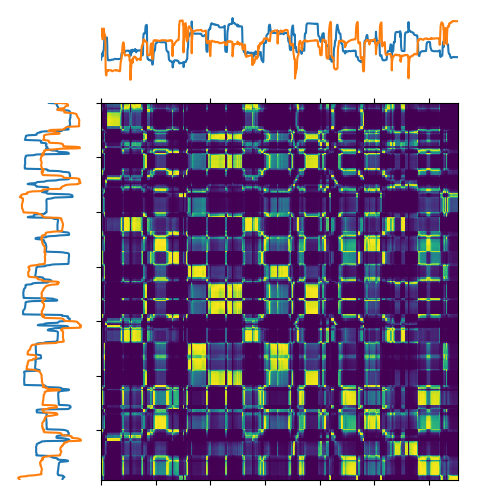
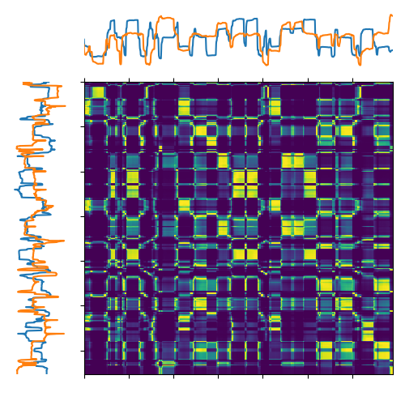
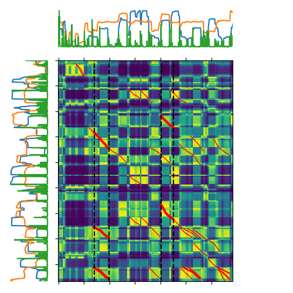
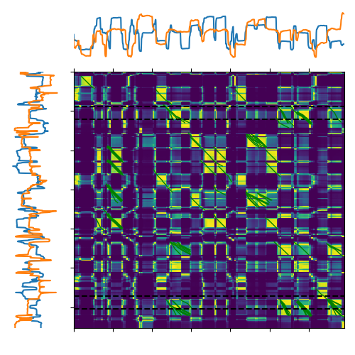
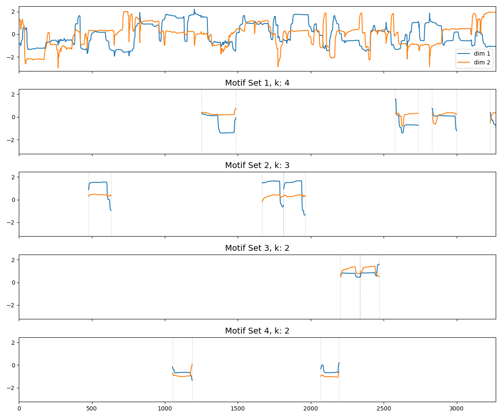

# Introduction
Repository for master thesis implementation of a [LoCoMotif](https://github.com/ML-KULeuven/locomotif) extension for finding consensus motifs.

# Getting started
1. Installation process
    - Clone the repository
    - Navigate to the root directory of the repository
    - Run the command: `make install` (python>=3.12.* required to be installed with the py python launcher)
    - Activate the virtual environment
    - Run the scripts with the command: `python .app/app.py`

## Similarity matrices for Column and Row POVs:
 

## Found paths and motifs for both POVs:
 

## Motifs comparison:
